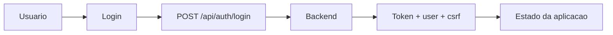

# 2. Fluxos e Integração com a API

## 2.1 Camada central de integração

O acesso à API é centralizado em:

- `src/api.js`
- `src/context/AppContext.jsx`
- `src/context/AppContext.jsx`

Essa camada:

- define a base da API
- envia headers de autenticação quando necessário
- envia `X-Client-Fingerprint`
- envia `X-CSRF-Token` quando aplicável
- traduz erros da API em mensagens amigáveis

## 2.2 Princípios da integração

- o frontend fala com a API por `src/api.js`
- o proxy `/api` preserva o fluxo de cookies
- o cliente não define a verdade de negócio
- mensagens de erro são traduzidas para uso na interface

## 2.3 Fluxo de login

```text
1. usuário abre /login
2. frontend envia POST /api/auth/login
3. recebe token e contexto do usuário
4. salva estado no fluxo da aplicação
5. usa refresh por cookie quando necessário
```

Exemplos de chamadas:

- `POST /api/auth/login`
- `POST /api/auth/refresh`
- `POST /api/auth/logout`
- `GET /api/questions`
- `GET /api/campaigns`
- `GET /api/campaigns/:id`
- `POST /api/assessments/start`
- `POST /api/assessments/:id/responses`
- `POST /api/assessments/:id/finish`
- `GET /api/assessments/:id/summary`

### Diagrama do fluxo de login



## 2.4 Fluxo de assessment

```text
1. frontend carrega campanha e perguntas
2. usuário responde o fluxo visual
3. frontend envia respostas ao backend
4. backend persiste e calcula
5. frontend exibe resumo e progresso
```

## 2.5 Fluxo de proxy

O `nginx` do frontend faz a ponte entre browser e backend para `/api`.

Isso é importante para:

- cookies
- refresh token
- CSRF
- manter a SPA e a API no mesmo host visível ao navegador
