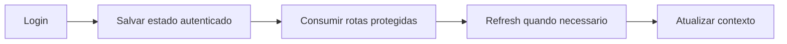

# 6. Estado Global, Sessão e Contexto

## 6.1 Objetivo

O frontend mantém o estado compartilhado necessário para a experiência do usuário autenticado.

## 6.2 Componente principal

Arquivo central:

- `src/context/AppContext.jsx`

## 6.3 Responsabilidades

Essa camada concentra:

- token em memória
- usuário autenticado
- política de login recebida da API
- assessments em memória de trabalho
- estado de carregamento de autenticação

Ações reais do reducer:

- `LOGIN`
- `UPDATE_USER`
- `LOGOUT`
- `SET_ASSESSMENTS`
- `SET_AUTH_LOADING`
- `SET_LOGIN_POLICY`

## 6.4 Fluxo de sessão

## 6.5 Regras importantes

- token de acesso não é fonte de verdade isolada
- refresh depende do backend
- CSRF e fingerprint são mantidos para o fluxo de sessão
- o contexto não substitui persistência oficial

## 6.6 Relação com a API

O contexto depende da API para:

- login
- refresh
- logout
- atualização do usuário autenticado

Detalhes concretos do código atual:

- o bootstrap chama `POST /api/auth/refresh`
- o logout automático por inatividade chama `POST /api/auth/logout`
- a verificação periódica roda a cada `30` segundos
