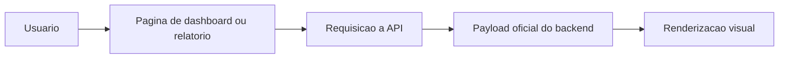

# 7. Dashboards, Relatórios e Visualização

## 7.1 Objetivo

O frontend transforma os dados oficiais da API em leitura visual utilizável.

## 7.2 Áreas principais

Páginas centrais:

- `src/pages/Dashboard.jsx`
- `src/pages/ExecutiveDashboard.jsx`
- `src/pages/Reports.jsx`

Essas páginas dependem de payloads oficiais vindos da API.

Exemplos do código atual:

- `Dashboard.jsx` reúne radar, donut, trend, funnel e heatmap
- `ExecutiveDashboard.jsx` organiza visão gerencial consolidada
- `Reports.jsx` possui abas executiva, analítica e técnica com exportação

## 7.3 Responsabilidades

O frontend é responsável por:

- renderizar indicadores
- organizar filtros visuais
- mostrar comparações e tendências
- permitir exportações acionadas pela interface

## 7.4 Limites dessa camada

O frontend não define:

- score oficial
- gap oficial
- regra de cálculo
- autorização final

## 7.5 Fluxo de visualização

## 7.6 Princípio importante

A responsabilidade desta camada é apresentação, não autoridade de negócio.
